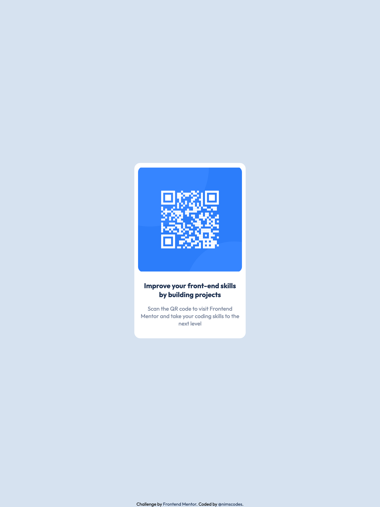

# Frontend Mentor - QR code component solution

This is a solution to the [QR code component challenge on Frontend Mentor](https://www.frontendmentor.io/challenges/qr-code-component-iux_sIO_H). Frontend Mentor challenges help you improve your coding skills by building realistic projects. 

## Table of contents

- [Overview](#overview)
  - [Screenshot](#screenshot)
  - [Links](#links)
- [My process](#my-process)
  - [Built with](#built-with)
  - [Useful resources](#useful-resources)
- [Author](#author)
- [Acknowledgments](#acknowledgments)

## Overview

### Screenshot

Mobile View 

Desktop View

### Links

- Solution URL: [https://github.com/nimscodes/qr-cpm](https://github.com/nimscodes/qr-cpm)
- Live Site URL: [https://nimscodes.github.io/qr-cpm/](https://nimscodes.github.io/qr-cpm/)

## My process

### Built with

- Semantic HTML5 markup
- CSS custom properties
- Flexbox
- Mobile-first workflow

### Useful resources

- [11 Ways to Center Div or Text in Div in CSS](https://blog.hubspot.com/website/center-div-css) - This helped me center the cards container. I really liked this pattern and will use it going forward.

## Author

- Website - [Prince Andrews Nimako](https://nimscodes.vercel.app/)
- Frontend Mentor - [@nimscodes](https://www.frontendmentor.io/profile/nimscodes)

